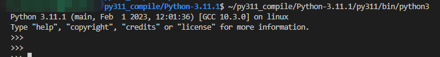
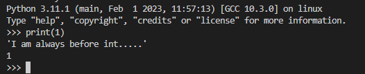

<!--  -->


##### 环境
``` shell
system: ubuntu-server 18.04
python version: 3.11
```
##### 编译python需要的库
``` shell
sudo apt-get install bzip2 libbz2-dev sqlite3 libsqlite3-dev libgdbm-dev uuid-dev tk-dev
```

##### 下载源码并解压
``` shell
# 下载
> wget https://www.python.org/ftp/python/3.11.1/Python-3.11.1.tar.xz
# 解压
> tar -xvf Python-3.11.1.tar.xz
```

##### 编译安装
``` shell
> cd Python-3.11.1
> ./configure --prefix=<Python要安装到的目录(绝对路径)>
> make
> make install
```

##### 验证
``` shell
> <Python安装目录>/bin/python3
```


##### 修改源码
``` c
// Objects/longobject.c
// 这里修改print整数时打印一行字符串
static PyObject *
long_to_decimal_string(PyObject *aa)
{
    PyObject *str = PyUnicode_FromString("I am always before int.....");  // +
    PyObject_Print(str, stdout, 0);  // +
    printf("\n");  // +

    PyObject *v;
    if (long_to_decimal_string_internal(aa, &v, NULL, NULL, NULL) == -1)
        return NULL;
    return v;
}
```

##### 修改完源码重新编译

``` shell
# 回到源码的解压目录 Python-3.11.1
> make && make bininstall
```


##### 正常重新编译的步骤
``` shell
> make clean
# 重新跑一遍
> ./configure --prefix=<Python要安装到的目录(绝对路径)>
> make
> make install
```

## 参考：

[UNIX/Linux 环境下编译 Python](https://flaggo.github.io/python3-source-code-analysis/preface/unix-linux-build/)